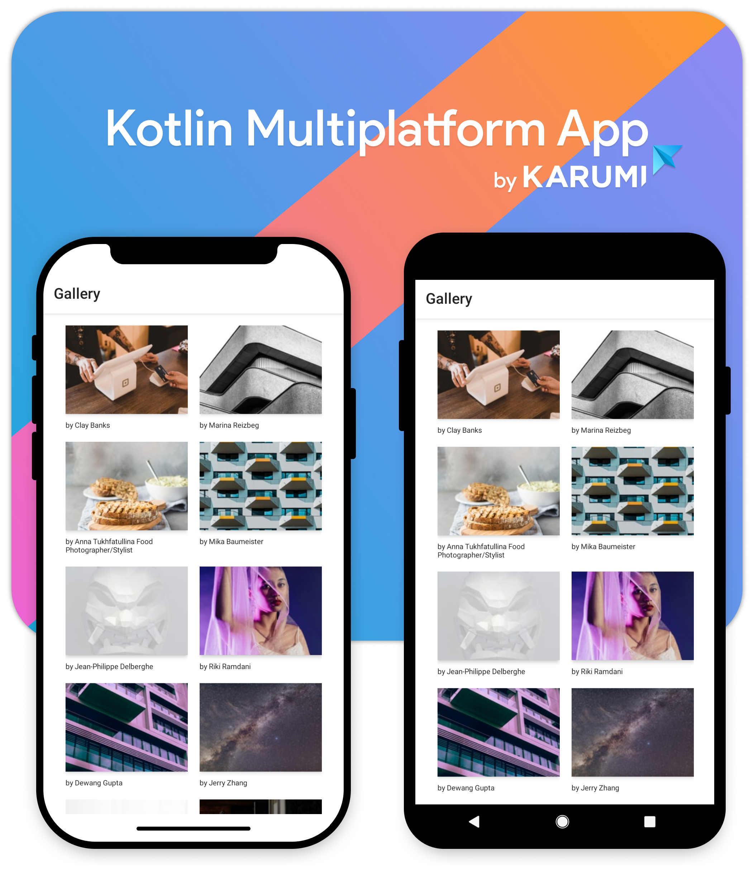

<p align="center"></p>

---------------------

Application example with Kotlin multiplatform that renders images from [Unplash][unplash]. 

You can read about the implementation in the following Multiplatform blog post series:

- [First steps into Kotlin Multiplatform](https://blog.karumi.com/first-steps-into-kotlin-multiplatform/)
- [Shared Library in Kotlin Multiplatform](https://blog.karumi.com/shared-library-in-kotlin-multiplatform/)

### Running tests locally

- Shared code: `./gradlew test connectedAndroidTest`
- iOS application: `xcodebuild -workspace 'PhotoGallery.xcworkspace' -scheme 'PhotoGallery' -destination 'platform=iOS Simulator,name=iPhone 6s Plus' build test CODE_SIGN_IDENTITY=-`

### Running the app

To run the application use the same tools you use in Android and iOS. Just open the project with Intellj/Android Studio for the Android project and XCode for the iOS one.

### FAQ

**I'm receiving an error message reading `SDK location not found` while building the iOS project.**

This usually means you need to define the SDK location path in a `local.properties` file for the Android SDK and NDK.

> local.properties
```
ndk.dir=/Users/<username>/Library/Android/sdk/ndk-bundle
sdk.dir=/Users/<username>/Library/Android/sdk
```
  
License
-------

    Copyright 2019 Karumi

    Licensed under the Apache License, Version 2.0 (the "License");
    you may not use this file except in compliance with the License.
    You may obtain a copy of the License at

       http://www.apache.org/licenses/LICENSE-2.0

    Unless required by applicable law or agreed to in writing, software
    distributed under the License is distributed on an "AS IS" BASIS,
    WITHOUT WARRANTIES OR CONDITIONS OF ANY KIND, either express or implied.
    See the License for the specific language governing permissions and
    limitations under the License.

[unplash]: https://unsplash.com/
